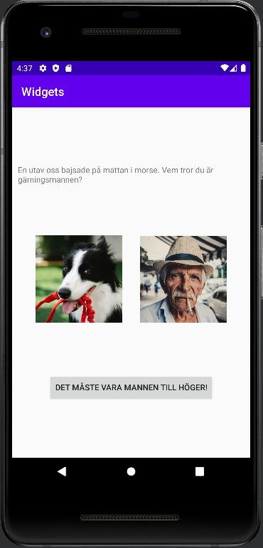

# Rapport

The app has a constraint layout consisting of a bigger layout parent and four child elements.
These child elements are views with varying types: image, text and button.
The layout's structure can be seen below: 

```
<androidx.constraintlayout.widget.ConstraintLayout . . .  >
    <ImageView . . . />
    <ImageView . . . />
    <TextView . . . />
    <Button . . . />
</androidx.constraintlayout.widget.ConstraintLayout>
```
In order to fulfill the requirements of a constraint layout, there must be constraints. 
Therefore every element (except for the layout parent) gets a constraint for every 
side: top, bottom, start and end. As an example, the code for one of the imageviews can be seen below.
Some constraints include the end being constrained to the end of the parent, the start constrained to the 
end of another imageview and et cetera. Different types of views are added to the app by using different tags and attributes,  
for example "app:srcCompat=''" is the attribute which specifies which drawable the imageview should have.
Notice that the tag starts with "ImageView" instead of e.g. "TextView", indicating it's type.

```
    <ImageView
        . . .
        android:layout_width="150dp"
        android:layout_height="150dp"
        app:layout_constraintEnd_toEndOf="parent"
        app:layout_constraintStart_toEndOf="@id/dogImg"
        app:layout_constraintBottom_toTopOf="@id/button2"
        app:layout_constraintTop_toBottomOf="@id/textView2"
        app:srcCompat="@drawable/man" />
```

To add some margin for visual purposes, the following line of code is added to the layout parent.

```
    android:layout_margin="10dp"
```

All views are then constrained in a similar way, a way in which they are relative to each other 
or the parent. After having placed all views the app gets the following appearance:

